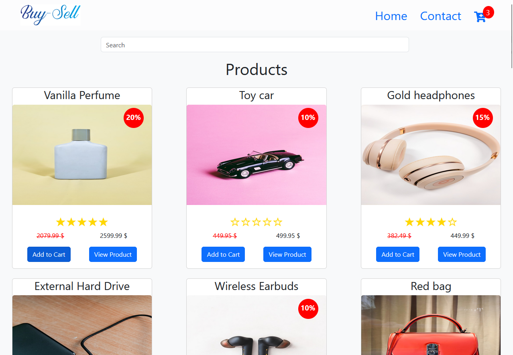

# Js-Frameworks

## Buy-Sell



This is a javascript-frameworks course assignment for Front-end Development at Noroff.

## Goal

To apply knowledge of React to build an eCom store.

## Requirements

All API functionality is managed by an existing application. This project only covers the front-end application for the API.

## Built With

- HTML
- CSS
- SASS
- [Bootstrap](https://getbootstrap.com)
- React

## Project Links

[Deployed website](https://buy-sell-ecom.netlify.app/)

[Github repository](https://github.com/ftmkrtgz/js-frameworks)

## Getting Started

### Installing

1. Clone the repo:

```bash
git clone https://github.com/ftmkrtgz/js-frameworks
```

2. Install the dependencies

```bash
npm install
```

### Running

1. To run the app, run the following commands:

```bash
npm run start
```

## Contributing

If you want to contribute to a project and make it better, your help is very welcome.

1. Make your changes and commit them:

    ```bash
    git add .
    git commit -m "Description of your changes"
    ```

2. Push to your branch and open a pull request.

## Contact

[My Portfolio Page](https://fatma-krtgz.netlify.app/)

[My LinkedIn Page](https://www.linkedin.com/in/fatma-kurtg%C3%B6z%C3%BC-5693aa288/)